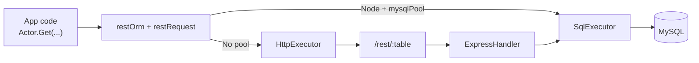

[](https://github.com/CarbonORM/CarbonNode/actions/workflows/npm-publish-on-bump.yml)

# CarbonNode

CarbonNode is a part of the CarbonORM series. It is a NodeJS MySQL ORM that can run independently in the backend or paired with 
CarbonReact for 1=1 syntax. Note the CarbonNode + CarbonReact experience is unmatched in interoperability.

# Purpose

CarbonNode is designed to generate RESTful API bindings for a MySQL database. The generated code provides a simple and
consistent interface for performing CRUD operations on the database tables. The goal is to reduce the amount of boilerplate
code needed to interact with the database and to provide a more efficient and reliable way to work with MySQL data in a NodeJS
environment. The major goals:
- Allow a 1-1 interoperability when querying data from the frontend to the backend. 
- Language based Objects/Arrays for representing and modifying queries to eliminate string manipulation operations.
- Explicit column references to allow for easier refactoring and code completion in IDEs. 
  - Selecting a dead column will result in a compile time error instead of a runtime error.
- TypeScript types generated for each table in the database.
- Lifecycle hooks for each CRUD operation to allow for custom logic to be executed before and after the operation.
- Validation of data types and formats before executing CRUD operations to ensure data integrity.

It's easier to scale your middleware than your database. 
CarbonNode aims to capture issues before they reach your database.


## Alpha Release

This is an alpha release. The code is not yet ready for production. We are looking for feedback on the API and any bugs.
Some features are not yet implemented. We are working on the documentation and will be adding more examples. Please 
check out [any issue](https://github.com/CarbonORM/CarbonWordPress/issues) we have open and feel free to contribute.

## Installation

CarbonNode is available on [NPM](https://www.npmjs.com/). You'll need to have [NodeJS](https://nodejs.org/en/) installed 
which comes prepackaged with npm (node package manager). 

```bash
npm install @carbonorm/carbonnode
```

## Generate Models

The generator produces a single `C6.ts` file containing all tables, types, and REST bindings. Keep this file in version
control and share it between server and client. All arguments are optional; the example below shows the defaults.

```bash
npx generateRestBindings --user root --pass password --host 127.0.0.1 --port 3306 --dbname carbonPHP --prefix carbon_ --output ./shared/rest/C6.ts
```

The generated file exports `C6`, `GLOBAL_REST_PARAMETERS`, `TABLES`, `ORM`, and per-table bindings (e.g. `Users`):

```typescript
import { C6, GLOBAL_REST_PARAMETERS, Users } from "./shared/rest/C6";
```

You can view the generator source in
[CarbonNode](https://github.com/CarbonORM/CarbonNode/blob/main/scripts/generateRestBindings.ts). We use
[Handlebars templates](https://mustache.github.io/) to generate the code.

### Runtime Setup

CarbonNode executes SQL directly when `GLOBAL_REST_PARAMETERS.mysqlPool` is provided. If no pool is set, it will use
the HTTP executor (useful for frontends or non-Node runtimes).

```typescript
import mysql from "mysql2/promise";
import { GLOBAL_REST_PARAMETERS } from "./shared/rest/C6";

GLOBAL_REST_PARAMETERS.mysqlPool = mysql.createPool({
    host: "127.0.0.1",
    user: "root",
    password: "password",
    database: "carbonPHP",
});

// Optional HTTP path:
// GLOBAL_REST_PARAMETERS.axios = axiosInstance;
// GLOBAL_REST_PARAMETERS.restURL = "/rest/";

// Optional websocket broadcast on writes:
// GLOBAL_REST_PARAMETERS.websocketBroadcast = (payload) => wsServer.broadcast(JSON.stringify(payload));
```

### Request Flow



### SQL Allowlist

To restrict which SQL statements can run in production, set `GLOBAL_REST_PARAMETERS.sqlAllowListPath` to a JSON file
containing allowed SQL strings. When the path is set, `SqlExecutor` normalizes whitespace and validates each query against
the allowlist. If the file is missing, an error is thrown; if the SQL is not listed, execution is blocked.

```typescript
GLOBAL_REST_PARAMETERS.sqlAllowListPath = "/path/to/sqlAllowList.json";
```

Allowlist format:

```json
[
  "SELECT * FROM `actor` LIMIT 1"
]
```

Generated tests in `src/__tests__/sakila-db/C6.test.ts` write response fixtures into `src/__tests__/sakila-db/sqlResponses/`
and compile `src/__tests__/sakila-db/C6.sqlAllowList.json` after the suite finishes. Pass that file path to enable
validation.

When using the REST handler directly, forward the path as well:

```typescript
app.all("/rest/:table", ExpressHandler({ C6, mysqlPool, sqlAllowListPath }));
```

### Generated Tests

The generator also writes `C6.test.ts` alongside `C6.ts`. Tests use Vitest and the generated bindings. Keep or delete the
file depending on your workflow.

The generator also writes `C6.MySqlDump.json`, `C6.mysqldump.sql`, and `C6.mysql.cnf` into the same output directory for
debugging and inspection.

### Templates

Two templates are used to generate the output:

1) [C6.ts.handlebars](https://github.com/CarbonORM/CarbonNode/blob/main/scripts/assets/handlebars/C6.ts.handlebars)
2) [C6.test.ts.handlebars](https://github.com/CarbonORM/CarbonNode/blob/main/scripts/assets/handlebars/C6.test.ts.handlebars)

#### Generation Example

0) **npx generateRestBindings** is executed.
1) **The MySQL dump tool** outputs a structure for every table.

```mysql
CREATE TABLE actor (
  actor_id SMALLINT UNSIGNED NOT NULL AUTO_INCREMENT,
  first_name VARCHAR(45) NOT NULL,
  last_name VARCHAR(45) NOT NULL,
  last_update TIMESTAMP NOT NULL DEFAULT CURRENT_TIMESTAMP ON UPDATE CURRENT_TIMESTAMP,
  PRIMARY KEY  (actor_id),
  KEY idx_actor_last_name (last_name)
) ENGINE=InnoDB DEFAULT CHARSET=utf8mb4;
```

2) **The generator** parses the table structure and creates an internal representation.
```typescript
export interface iActor {
    'actor_id'?: number;
    'first_name'?: string;
    'last_name'?: string;
    'last_update'?: Date | number | string;
}

export type ActorPrimaryKeys =
    'actor_id'
    ;

const actor:
    C6RestfulModel<
        'actor',
        iActor,
        ActorPrimaryKeys
    > = {
    TABLE_NAME: 'actor',
    ACTOR_ID: 'actor.actor_id',
    FIRST_NAME: 'actor.first_name',
    LAST_NAME: 'actor.last_name',
    LAST_UPDATE: 'actor.last_update',
    PRIMARY: [
        'actor.actor_id',
    ],
    PRIMARY_SHORT: [
        'actor_id',
    ],
    COLUMNS: {
        'actor.actor_id': 'actor_id',
        'actor.first_name': 'first_name',
        'actor.last_name': 'last_name',
        'actor.last_update': 'last_update',
    },
    TYPE_VALIDATION: {
        'actor.actor_id': {
            MYSQL_TYPE: 'smallint',
            MAX_LENGTH: '',
            AUTO_INCREMENT: true,
            SKIP_COLUMN_IN_POST: false
        },
        'actor.first_name': {
            MYSQL_TYPE: 'varchar',
            MAX_LENGTH: '45',
            AUTO_INCREMENT: false,
            SKIP_COLUMN_IN_POST: false
        },
        'actor.last_name': {
            MYSQL_TYPE: 'varchar',
            MAX_LENGTH: '45',
            AUTO_INCREMENT: false,
            SKIP_COLUMN_IN_POST: false
        },
        'actor.last_update': {
            MYSQL_TYPE: 'timestamp',
            MAX_LENGTH: '',
            AUTO_INCREMENT: false,
            SKIP_COLUMN_IN_POST: false
        },
    },
    REGEX_VALIDATION: {
    },
    LIFECYCLE_HOOKS: {
        GET: {beforeProcessing:{}, beforeExecution:{}, afterExecution:{}, afterCommit:{}},
        PUT: {beforeProcessing:{}, beforeExecution:{}, afterExecution:{}, afterCommit:{}},
        POST: {beforeProcessing:{}, beforeExecution:{}, afterExecution:{}, afterCommit:{}},
        DELETE: {beforeProcessing:{}, beforeExecution:{}, afterExecution:{}, afterCommit:{}},
    },
    TABLE_REFERENCES: {

    },
    TABLE_REFERENCED_BY: {
        'actor_id': [{
            TABLE: 'film_actor',
            COLUMN: 'actor_id',
            CONSTRAINT: 'fk_film_actor_actor',
        },],
    }
}

export const Actor = {
    ...actor,
    ...restOrm<
        OrmGenerics<any, 'actor', iActor, ActorPrimaryKeys>
    >(() => ({
        ...GLOBAL_REST_PARAMETERS,
        restModel: actor
    }))
}
```

3) **Profit**
You import from the frontend or backend using the same syntax:

```typescript
import { Actor, C6 } from "./shared/rest/C6";

// GET
const actors = await Actor.Get({
    [C6.SELECT]: [
        Actor.ACTOR_ID,
        Actor.FIRST_NAME,
        Actor.LAST_NAME,
    ],
    [C6.WHERE]: {
        [Actor.LAST_NAME]: [C6.LIKE, [C6.LIT, "%PITT%"]],
    },
    [C6.PAGINATION]: { [C6.LIMIT]: 10 },
});

// POST
await Actor.Post({
    [Actor.FIRST_NAME]: "Brad",
    [Actor.LAST_NAME]: "Pitt",
});

// PUT (singular)
await Actor.Put({
    [Actor.ACTOR_ID]: 42,
    [Actor.LAST_NAME]: "Updated",
});

// DELETE (singular)
await Actor.Delete({
    [Actor.ACTOR_ID]: 42,
});
```

### SQL Expression Grammar

CarbonNode 6.1.0 uses one tuple-based grammar for SQL expressions.

| Purpose | Canonical syntax |
| --- | --- |
| Known function | `[C6.FUNCTION_NAME, ...args]` |
| Custom function | `[C6.CALL, 'FUNCTION_NAME', ...args]` |
| Alias | `[C6.AS, expression, 'alias']` |
| DISTINCT modifier | `[C6.DISTINCT, expression]` |
| String / scalar literal binding | `[C6.LIT, value]` |
| ORDER term | `[expression, 'ASC' | 'DESC']` |

Rules:

- Bare strings are treated as references only (for example `actor.first_name` or a SELECT alias).
- Non-reference strings must be wrapped with `[C6.LIT, ...]`.
- Legacy positional alias tuples are removed. Use `[C6.AS, expression, alias]`.
- Object-rooted function expressions are removed. Use tuple syntax.

Migration examples:

```typescript
// Before (removed)
[C6.COUNT, Actor.ACTOR_ID, C6.AS, "cnt"]

// After
[C6.AS, [C6.COUNT, Actor.ACTOR_ID], "cnt"]

// Before (removed)
[C6.ST_GEOMFROMTEXT, ["POINT(-104.89 39.39)", 4326]]

// After
[C6.ST_GEOMFROMTEXT, [C6.LIT, "POINT(-104.89 39.39)"], 4326]

// ORDER BY example
[C6.PAGINATION]: {
  [C6.ORDER]: [
    [[C6.ST_DISTANCE_SPHERE, Property_Units.LOCATION, targetPoint], "ASC"],
    [Actor.LAST_NAME, "DESC"],
  ],
  [C6.LIMIT]: 25,
}
```

Example response payloads (HTTP executor):

GET

```json
{
  "success": true,
  "rest": [
    { "actor_id": 1, "first_name": "PENELOPE", "last_name": "GUINESS" }
  ],
  "next": "Function"
}
```

POST

```json
{
  "success": true,
  "created": 201,
  "rest": { "actor_id": 201, "first_name": "Brad", "last_name": "Pitt" }
}
```

PUT

```json
{
  "success": true,
  "updated": true,
  "rest": { "actor_id": 42, "last_name": "Updated" }
}
```

DELETE

```json
{
  "success": true,
  "deleted": true,
  "rest": { "actor_id": 42 }
}
```

SQL executor responses omit `success` and include `sql` for GETs plus `affected` for writes. Express responses from `ExpressHandler` add `success: true`.

SQL executor example (GET):

```json
{
  "rest": [
    { "actor_id": 1, "first_name": "PENELOPE", "last_name": "GUINESS" }
  ],
  "sql": {
    "sql": "SELECT * FROM `actor` LIMIT 10",
    "values": []
  }
}
```

Our CarbonReact extends this solution for automatic state and pagination management.


# Git Hooks

This project uses Git hooks to automate certain tasks:

- **post-commit**: Builds the project before pushing to ensure only working code is pushed
- **post-push**: Automatically publishes to npm when the version number changes

To set up the Git hooks, run:

```bash
npm run hooks:setup
```

This will configure Git to use the hooks in the `.githooks` directory. The hooks are automatically set up when you run `npm install` as well.

# Support and Issues

Any issues found should be reported on [GitHub](https://github.com/CarbonORM/CarbonNode/issues).
