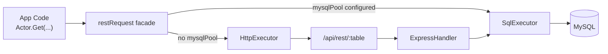

[](https://github.com/CarbonORM/CarbonNode/actions/workflows/npm-publish-on-bump.yml)

# CarbonNode

CarbonNode is a typed MySQL ORM runtime plus code generator for REST bindings.

It is built for:

- full-stack teams that want one query shape across frontend and backend
- explicit column references and safer query composition
- JSON-serializable SQL expression payloads with predictable parsing
- generated TypeScript bindings from live MySQL schema

It can run in two modes:

- SQL executor (`mysqlPool` set): executes SQL directly in Node
- HTTP executor (no pool, axios set): sends requests to a CarbonNode REST endpoint

## Table of Contents

1. [Install](#install)
2. [Quickstart](#quickstart)
3. [Execution Model](#execution-model)
4. [C6 + CarbonReact State Management](#c6--carbonreact-state-management)
5. [Canonical SQL Expression Grammar (6.1.0+)](#canonical-sql-expression-grammar-610)
6. [Clause-by-Clause Usage](#clause-by-clause-usage)
7. [Helper Builders](#helper-builders)
8. [Singular vs Complex Requests](#singular-vs-complex-requests)
9. [HTTP Query-String Pitfalls](#http-query-string-pitfalls)
10. [Generator Output](#generator-output)
11. [SQL Allowlist](#sql-allowlist)
12. [Lifecycle Hooks and Websocket Broadcast](#lifecycle-hooks-and-websocket-broadcast)
13. [Testing](#testing)
14. [Migration Notes (6.0 -> 6.1)](#migration-notes-60---61)
15. [AI Interpretation Contract](#ai-interpretation-contract)
16. [Git Hooks](#git-hooks)
17. [Support](#support)

## Install

```bash
npm install @carbonorm/carbonnode
```

Peer dependencies:

- `mysql2` for SQL executor mode
- `axios` for HTTP executor mode
- `express` only if hosting the REST route in your app

## Quickstart

### 1) Generate bindings

Generate `C6.ts` + `C6.test.ts` + dump artifacts into an output directory:

```bash
npx generateRestBindings \
  --user root \
  --pass password \
  --host 127.0.0.1 \
  --port 3306 \
  --dbname sakila \
  --prefix "" \
  --output ./shared/rest
```

Import from generated bindings:

```ts
import { C6, GLOBAL_REST_PARAMETERS, Actor } from "./shared/rest/C6";
```

### 2) Configure runtime

#### SQL executor mode (Node + direct DB)

```ts
import mysql from "mysql2/promise";
import { GLOBAL_REST_PARAMETERS } from "./shared/rest/C6";

GLOBAL_REST_PARAMETERS.mysqlPool = mysql.createPool({
  host: "127.0.0.1",
  user: "root",
  password: "password",
  database: "sakila",
});
```

#### HTTP executor mode (frontend or remote client)

```ts
import { axiosInstance } from "@carbonorm/carbonnode";
import { GLOBAL_REST_PARAMETERS } from "./shared/rest/C6";

GLOBAL_REST_PARAMETERS.axios = axiosInstance;
GLOBAL_REST_PARAMETERS.restURL = "/api/rest/";
```

If you are using CarbonReact, wire `reactBootstrap` as described in [C6 + CarbonReact State Management](#c6--carbonreact-state-management).

### 3) Host the REST endpoint (optional, Express)

```ts
import express from "express";
import mysql from "mysql2/promise";
import { restExpressRequest } from "@carbonorm/carbonnode";
import { C6 } from "./shared/rest/C6";

const app = express();
app.set("query parser", "extended");
app.use(express.json());

const mysqlPool = mysql.createPool({
  host: "127.0.0.1",
  user: "root",
  password: "password",
  database: "sakila",
});

restExpressRequest({
  router: app,
  routePath: "/api/rest/:table{/:primary}",
  C6,
  mysqlPool,
});
```

### 4) Query data

```ts
import { C6, Actor } from "./shared/rest/C6";

const result = await Actor.Get({
  [C6.SELECT]: [
    Actor.ACTOR_ID,
    Actor.FIRST_NAME,
    Actor.LAST_NAME,
  ],
  [C6.WHERE]: {
    [Actor.LAST_NAME]: [C6.LIKE, [C6.LIT, "%PITT%"]],
  },
  [C6.PAGINATION]: {
    [C6.LIMIT]: 10,
    [C6.PAGE]: 1,
    [C6.ORDER]: [[Actor.ACTOR_ID, C6.DESC]],
  },
});
```

## Execution Model



`restRequest` chooses SQL executor when `mysqlPool` is present; otherwise it uses HTTP executor.

## C6 + CarbonReact State Management

If your app uses [CarbonReact](https://github.com/CarbonORM/CarbonReact), CarbonNode can keep table state in sync automatically after requests.

Set:

```ts
import { GLOBAL_REST_PARAMETERS } from "./shared/rest/C6";

GLOBAL_REST_PARAMETERS.reactBootstrap = yourCarbonReactInstance;
```

State sync behavior:

- HTTP executor path:
  - `GET`: updates table state with response rows
  - `POST`: inserts created row(s) into state
  - `PUT`: updates matching row(s) by primary key
  - `DELETE`: removes matching row(s) by primary key
- SQL executor path:
  - `GET`: updates table state when `reactBootstrap` is set
  - write sync is typically handled by your websocket/event layer

How C6 identifies rows:

- `stateKey` is table name (`restModel.TABLE_NAME`)
- `uniqueObjectId` is table primary keys (`restModel.PRIMARY_SHORT`)

Per-request escape hatch:

```ts
await SomeTable.Get({
  /* query */
  skipReactBootstrap: true,
});
```

This lets you opt out of automatic state writes when a call is read-only for the UI or you are running a background sync pass.

## Canonical SQL Expression Grammar (6.1.0+)

`6.1.0` unifies expression parsing across `SELECT`, `WHERE`, `HAVING`, `ORDER`, and expression-capable `UPDATE`/`INSERT` values.

| Purpose | Canonical form |
| --- | --- |
| Known function | `[C6.FUNCTION_NAME, ...args]` |
| Custom function | `[C6.CALL, "FUNCTION_NAME", ...args]` |
| Alias | `[C6.AS, expression, "alias"]` |
| DISTINCT | `[C6.DISTINCT, expression]` |
| Literal binding | `[C6.LIT, value]` |
| ORDER term | `[expression, "ASC" \| "DESC"]` |

Normative rules:

- Bare strings are references only (`table.column` or valid aliases in context).
- Non-reference strings must be wrapped with `[C6.LIT, value]`.
- `AS` and `DISTINCT` are wrappers, not positional tokens.
- `PAGINATION.ORDER` must be an array of order terms.
- Use `C6.CALL` for unknown/custom function names.

Removed legacy syntax (throws):

- `[fn, ..., C6.AS, alias]`
- `[column, C6.AS, alias]`
- object-rooted function expressions like `{ [C6.COUNT]: [...] }`
- implicit string literals in function arguments
- `ORDER` object-map syntax (now array terms only)

## Clause-by-Clause Usage

### SELECT with wrappers

```ts
import { C6, Actor } from "./shared/rest/C6";

const response = await Actor.Get({
  [C6.SELECT]: [
    [C6.AS, [C6.DISTINCT, Actor.FIRST_NAME], "distinct_name"],
    [C6.AS, [C6.COUNT, Actor.ACTOR_ID], "cnt"],
    [C6.CALL, "COALESCE", [C6.LIT, "Unknown"], Actor.LAST_NAME],
  ],
});
```

### WHERE with literals, BETWEEN, IN, AND/OR

```ts
import { C6, Actor } from "./shared/rest/C6";

const response = await Actor.Get({
  [C6.WHERE]: {
    [C6.AND]: [
      { [Actor.LAST_NAME]: [C6.LIKE, [C6.LIT, "S%"]] },
      { [Actor.ACTOR_ID]: [C6.BETWEEN, [5, 50]] },
      { [Actor.FIRST_NAME]: [C6.IN, [[C6.LIT, "NICK"], [C6.LIT, "ED"]]] },
    ],
  },
});
```

### JOIN

```ts
import { C6, Actor, Film_Actor } from "./shared/rest/C6";

const response = await Actor.Get({
  [C6.SELECT]: [Actor.ACTOR_ID, Actor.FIRST_NAME],
  [C6.JOIN]: {
    [C6.INNER]: {
      [Film_Actor.TABLE_NAME]: {
        [Film_Actor.ACTOR_ID]: [C6.EQUAL, Actor.ACTOR_ID],
      },
    },
  },
});
```

### ORDER and pagination

```ts
import { C6, Actor } from "./shared/rest/C6";

const response = await Actor.Get({
  [C6.PAGINATION]: {
    [C6.ORDER]: [
      [Actor.LAST_NAME, C6.ASC],
      [Actor.FIRST_NAME, C6.DESC],
    ],
    [C6.LIMIT]: 25,
    [C6.PAGE]: 1,
  },
});
```

`PAGE` is 1-based:

- `PAGE = 1` -> first page
- `PAGE = 2` -> second page
- `PAGE = 0` is coerced to `1`

### UPDATE expression values

```ts
import { C6, Actor } from "./shared/rest/C6";

await Actor.Put({
  [Actor.ACTOR_ID]: 42,
  [C6.UPDATE]: {
    [Actor.FIRST_NAME]: [C6.CONCAT, [C6.LIT, "Mr. "], Actor.LAST_NAME],
  },
});
```

## Helper Builders

CarbonNode exports typed builders that return canonical tuples:

```ts
import { fn, call, alias, distinct, lit, order } from "@carbonorm/carbonnode";
import { C6, Actor } from "./shared/rest/C6";

const response = await Actor.Get({
  [C6.SELECT]: [
    alias(distinct(Actor.FIRST_NAME), "distinct_name"),
    alias(fn(C6.COUNT, Actor.ACTOR_ID), "cnt"),
    call("COALESCE", lit("N/A"), Actor.LAST_NAME),
  ],
  [C6.PAGINATION]: {
    [C6.ORDER]: [order(fn(C6.COUNT, Actor.ACTOR_ID), C6.DESC)],
    [C6.LIMIT]: 5,
  },
});
```

## Singular vs Complex Requests

Singular requests (primary key at root) are normalized into complex query format.

```ts
await Actor.Get({ [Actor.ACTOR_ID]: 42 });
await Actor.Put({ [Actor.ACTOR_ID]: 42, [Actor.LAST_NAME]: "Updated" });
await Actor.Delete({ [Actor.ACTOR_ID]: 42 });
```

Behavior:

- `GET` with missing PKs remains a collection query.
- `PUT`/`DELETE` singular forms require full PK coverage.

## HTTP Query-String Pitfalls

If you are manually building URLs, nested arrays must preserve tuple shape exactly.

Common failure:

- `WHERE[job_runs.job_type][0]=LIT&WHERE[job_runs.job_type][1]=avm_print`
- This is interpreted as operator tuple `[LIT, "avm_print"]`, and fails with:
  - `Invalid or unsupported SQL operator detected: 'LIT'`

Correct structure:

- `WHERE[job_runs.job_type][0]==`
- `WHERE[job_runs.job_type][1][0]=LIT`
- `WHERE[job_runs.job_type][1][1]=avm_print`

Also ensure `ORDER` is under `PAGINATION`:

- correct: `PAGINATION[ORDER][0][0]=job_runs.created_at`
- incorrect: `ORDER[0][0]=job_runs.created_at`

Recommendation: use generated bindings + axios executor, not manual URL construction.

## Generator Output

`generateRestBindings` writes:

- `C6.ts` (typed table model + REST bindings)
- `C6.test.ts` (generated test suite)
- `C6.mysqldump.sql`
- `C6.mysqldump.json`
- `C6.mysql.cnf`

Template sources:

- `scripts/assets/handlebars/C6.ts.handlebars`
- `scripts/assets/handlebars/C6.test.ts.handlebars`

## SQL Allowlist

To enforce a SQL allowlist in production:

```ts
import { GLOBAL_REST_PARAMETERS } from "./shared/rest/C6";

GLOBAL_REST_PARAMETERS.sqlAllowListPath = "/path/to/C6.sqlAllowList.json";
```

Optional: add a project-specific normalizer for allowlist matching:

```ts
import { GLOBAL_REST_PARAMETERS } from "./shared/rest/C6";

GLOBAL_REST_PARAMETERS.sqlQueryNormalizer = (normalizedSql) =>
  normalizedSql.toLowerCase();
```

`sqlQueryNormalizer` runs **after** CarbonNode's built-in normalization. Use it to enforce house-style matching (for example lowercase-only allowlist entries).

Allowlist file format:

```json
[
  "SELECT * FROM `actor` LIMIT 1"
]
```

Normalization behavior (important):

CarbonNode normalizes both:

- each SQL entry in your allowlist file
- each runtime SQL statement before matching

So you should treat allowlist entries as **normalized query shapes**, not exact byte-for-byte logs.

Normalization includes:

- stripping ANSI color codes
- collapsing whitespace
- removing trailing `;`
- normalizing common geo function names (`ST_DISTANCE_SPHERE`, `ST_GEOMFROMTEXT`, `MBRCONTAINS`)
- normalizing `LIMIT`/`OFFSET` numeric literals to placeholders
- collapsing bind groups (for example `IN (?, ?, ?)` -> `IN (? ×*)`)
- collapsing repeated `VALUES` bind rows to a wildcard row shape

Example (conceptual):

```sql
-- runtime SQL
SELECT * FROM `actor` WHERE actor.actor_id IN (?, ?, ?) LIMIT 100

-- normalized shape used for matching
SELECT * FROM `actor` WHERE actor.actor_id IN (? ×*) LIMIT ?
```

When enabled:

- missing allowlist file -> error
- SQL not in allowlist -> blocked

Practical workflow:

1. Run representative queries in tests/integration.
2. Collect normalized SQL statements.
3. Save them into your allowlist JSON.
4. Set `GLOBAL_REST_PARAMETERS.sqlAllowListPath`.

## Lifecycle Hooks and Websocket Broadcast

Generated models include lifecycle hook groups per method:

- `beforeProcessing`
- `beforeExecution`
- `afterExecution`
- `afterCommit`

Unlike other CarbonORM language bindings, C6.ts is not semi-persistent. 
Modifications to the C6 object should be done at runtime, not by editing the generated file.

Websocket payloads for writes are supported via:

```ts
GLOBAL_REST_PARAMETERS.websocketBroadcast = async (payload) => {
  // broadcast payload to your websocket infrastructure
};
```

### Real-time communication explained (no websocket background required)

HTTP is request/response. A browser asks, server answers, done.

Real-time systems add **server push**: when data changes, the server proactively notifies connected clients so they can refresh or patch state immediately.

In CarbonNode:

- `POST`, `PUT`, `DELETE` can trigger `websocketBroadcast`
- `GET` does not broadcast
- CarbonNode does **not** run a websocket server for you
- you provide the `websocketBroadcast` function and route payloads into your existing websocket layer (`ws`, Socket.IO, SSE bridge, etc.)

Payload shape (high level):

- table + method metadata
- request body
- request primary key (when detectable)
- response row(s) and response primary key when available

Why this matters:

- keeps multiple tabs/users aligned without polling
- reduces stale UI after writes
- enables event-driven cache invalidation (`table + primary key`)

Minimal `ws` example:

```ts
import { WebSocketServer } from "ws";
import { GLOBAL_REST_PARAMETERS } from "./shared/rest/C6";

const wss = new WebSocketServer({ server: httpServer });

GLOBAL_REST_PARAMETERS.websocketBroadcast = async (payload) => {
  const message = JSON.stringify({ type: "db.write", payload });
  for (const client of wss.clients) {
    if (client.readyState === 1) {
      client.send(message);
    }
  }
};
```

Client handling pattern:

1. listen for `db.write` events
2. inspect `payload.REST.TABLE_NAME` and primary keys
3. invalidate/refetch relevant queries or patch local state

## Testing

Run full validation:

```bash
npm test
```

This includes:

- build
- binding generation
- test suite

## Migration Notes (6.0 -> 6.1)

Before:

```ts
[C6.COUNT, Actor.ACTOR_ID, C6.AS, "cnt"]
```

After:

```ts
[C6.AS, [C6.COUNT, Actor.ACTOR_ID], "cnt"]
```

Before:

```ts
[C6.PAGINATION]: {
  [C6.ORDER]: { [Actor.LAST_NAME]: C6.ASC }
}
```

After:

```ts
[C6.PAGINATION]: {
  [C6.ORDER]: [[Actor.LAST_NAME, C6.ASC]]
}
```

Before:

```ts
[C6.ST_GEOMFROMTEXT, ["POINT(-104.89 39.39)", 4326]]
```

After:

```ts
[C6.ST_GEOMFROMTEXT, [C6.LIT, "POINT(-104.89 39.39)"], 4326]
```

## AI Interpretation Contract

Use this section as a strict contract for automated query generation.

```yaml
carbonnode:
  version: "6.1.0+"
  grammar:
    known_function: "[C6C.<KNOWN_FN>, ...args]"
    custom_function: "[C6C.CALL, 'FUNCTION_NAME', ...args]"
    alias: "[C6C.AS, expression, 'alias']"
    distinct: "[C6C.DISTINCT, expression]"
    literal: "[C6C.LIT, value]"
    order_term: "[expression, 'ASC' | 'DESC']"
  required_rules:
    - "Bare strings are references only."
    - "Wrap non-reference strings with C6C.LIT."
    - "PAGINATION.ORDER must be an array of order terms."
    - "Use C6C.CALL for unknown function names."
  forbidden_legacy:
    - "[fn, ..., C6C.AS, alias]"
    - "[column, C6C.AS, alias]"
    - "{ [C6C.COUNT]: [...] }"
    - "Implicit string literals in function args"
    - "ORDER object-map syntax"
```

## Git Hooks

This project uses Git hooks via `postinstall`:

- `post-commit`: builds project
- `post-push`: publishes to npm when version changes
- `npm install` runs `postinstall` to ensure hooks are configured

## Support

Report issues at:

- [CarbonNode Issues](https://github.com/CarbonORM/CarbonNode/issues)
